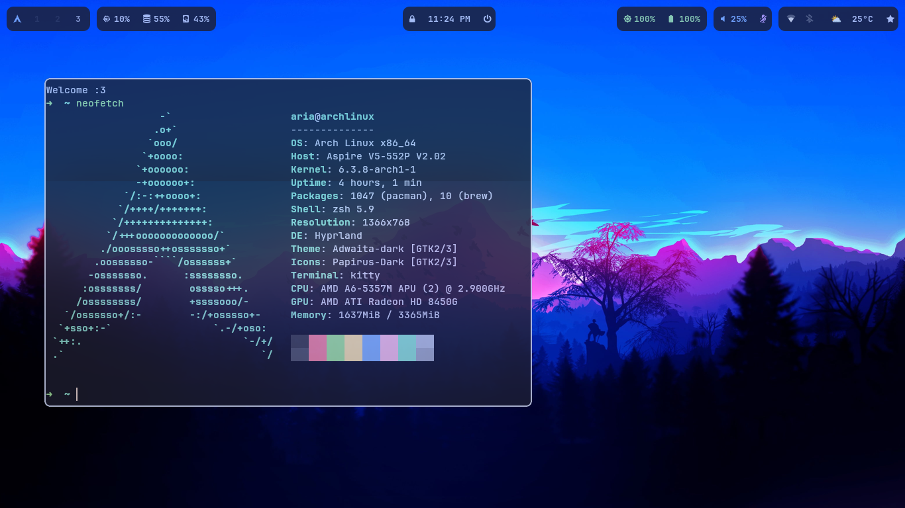
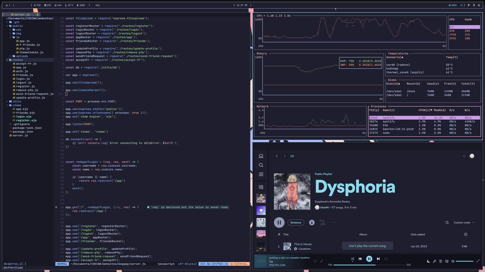
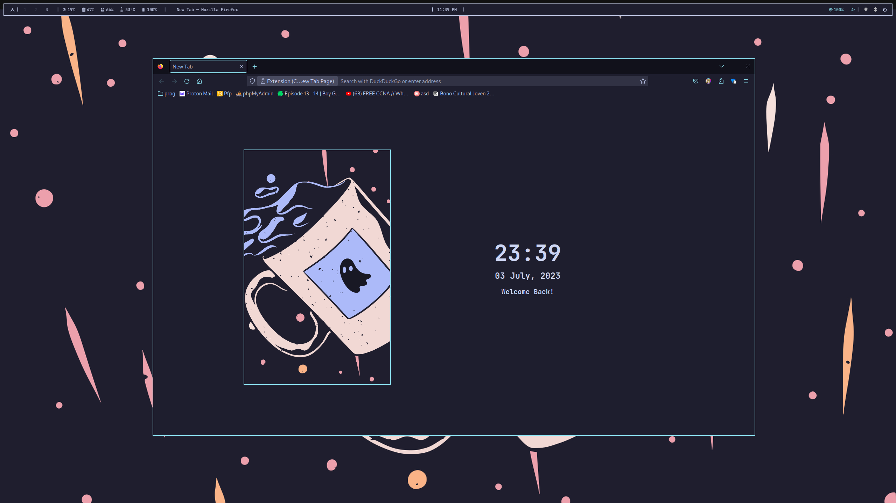

#  My dotfiles

In this github repo, you can find my current rice

- Catppuccin mocha &#128008;

## Information

### [Browser StartUp](http://www.fibla.es/search/)
- [github](https://github.com/lxbx44/website)

### Dunst
- **Theme:** Catppuccin mocha theme
- **Font:** Jetbrains mono nerd font

### Hyprland
- You might change the `hyprland.conf` file depending of your computer

- In the `scripts/` folder you can find the code to change from dark to light mode

### Kitty

- **Theme:** Catpuccin mocha theme
- **Font:** Jetbrains mono nerd font

### NeoVim

* **Theme:** Catppuccin mocha
* **Font:** Jetbrains mono nerd font

### Swaylock
- A good locking lock for when you leave your computer

### Thunar
File manager
- **Theme:** Catpuccin mocha theme
- **Font:** Jetbrains mono nerd font

### Waybar
- **Theme:** Catpuccin mocha theme
- **Font:** Jetbrains mono nerd fons
- In the `scripts/` folder you can find all the custom plugins

### Wlogout
- A good looking log out to close the computer

### Wofi
* A fast program launcher
- **Theme:** Catpuccin mocha theme
- **Font:** Jetbrains mono nerd fons

### Spicetify
- **Theme:** Catppuccin mocha
- **Custom apps:** Stats
- **Extensions:**
	- Adblock
	- Catppuccin-mocha
	- copytoclipboard2
	- CoverAmbience
	- fullAlbumDate
	- fullAppDisplayMod
	- playlist-icons
	- power-bar
	- QueueTime
	- remove-unplayable-songs
	- romaja_lyrics
	- romaji-convert
	- romaji_lyrics
	- seekSong
	- SleepTimer
	- spotifyGenres

**Once everything is installed, run the `apply.sh` file for applying all the changes**

### Better Discord
**Plugins:**
	- Better friend list
	- Call time counter
	- Hide disabled emojis
	- Image Utilities
	- Read all notifications button
	- Split large messages
	- Spotify controls
	- Typing users avatars
	- Game activity toggle

**Themes:**
	- Mocha
	- Better badges
	- Emoji replace
	- Radial status

## Pictures

