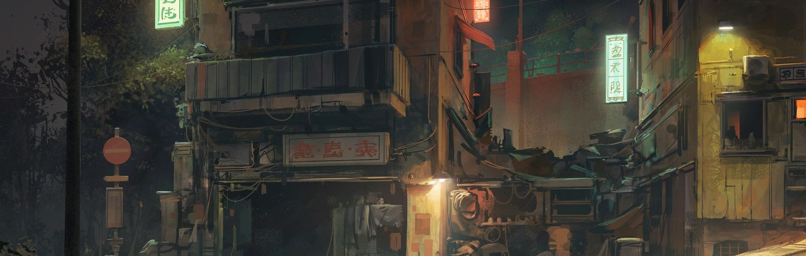

#  My dotfiles

Made by [Aria](https://github.com/lxbx44/)

Based on the [Gruvbox](https://github.com/morhetz/gruvbox) color scheme.

## Information

- **OS:** [ArchLinux](https://archlinux.org/)
- **WM:** [bspwm](https://github.com/baskerville/bspwm)
- **Compositor:** [Picom](https://github.com/yshui/pwmicom)
- **Shortcuts deamon:** [sxhkd](https://github.com/baskerville/sxhkd)
- **Terminal Emulator:** [Alacritty](https://alacritty.org/)
- **Status Bar:** [Polybar](https://github.com/polybar/polybar)
- **Wallpaper manager:** [Waypaper](https://github.com/anufrievroman/waypaper)
- **Notification Daemon:** [Dunst](https://github.com/dunst-project/dunst)
- **App launcher:** [Rofi](https://github.com/davatorium/rofi)
- **Shell:** [zsh](https://www.zsh.org/)
- **Shell Plugin Manager:** [OhMyZsh](https://ohmyz.sh/)
- **Shell Theme:** [Starship](https://starship.rs/)
- **IDE:** [NeoVim](https://neovim.io/)
- **File Manager:** [Thunar](https://wiki.archlinux.org/title/Thunar)
- **Browser:** [LibreWolf](https://librewolf.net/)
- **Font:** [Mononoki Nerd Font](https://www.jetbrains.com/lp/mono/)

## Pictures

